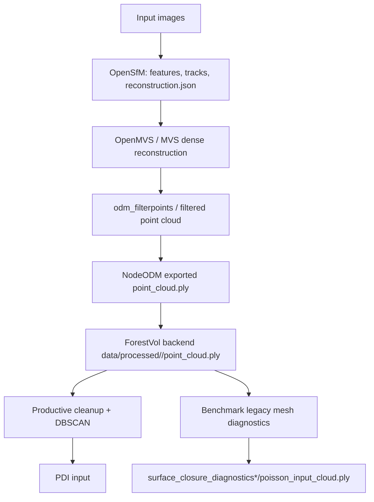

# NodeODM Artifact Graph

## set1

### benchmark

- session: `a3c36266-f866-402f-8bc8-1c2b59b4a4ce`
- nodeodm uuid: `56396d01-c139-445e-ba50-55644781e877`
- backend point cloud: `/app/data/processed/a3c36266-f866-402f-8bc8-1c2b59b4a4ce/point_cloud.ply`
- backend point cloud sha256: `6dda4d260a9cf2c7c9cc722379a3624b20c429b950c1bcd11c8acf29dc32430f`
- backend point count: `301159`

- benchmark PDI cloud: `/app/data/processed/a3c36266-f866-402f-8bc8-1c2b59b4a4ce/surface_closure_diagnostics/poisson_input_cloud.ply`
- benchmark PDI sha256: `32332ecad9d2bfe4401dcdb1335a646a4b7f5aceaeec7463204108ad1f3c2603`
- benchmark PDI point count: `19879`

### production

- session: `b3c14c84-b660-407f-817f-1fc185ce3e9c`
- nodeodm uuid: `4d324ed3-3ec9-446b-9976-39285560b6b5`
- backend point cloud: `/app/data/processed/b3c14c84-b660-407f-817f-1fc185ce3e9c/point_cloud.ply`
- backend point cloud sha256: `99c67aeed8feb3ab06bfe0f74c932af67aabbe5ebb0c8736b879c042846af777`
- backend point count: `401873`

## set2

### benchmark

- session: `b6b04af0-122f-4fcc-af8a-cc553ca5e28d`
- nodeodm uuid: `002ca5e3-6eca-4aba-b3e2-623f97878136`
- backend point cloud: `/app/data/processed/b6b04af0-122f-4fcc-af8a-cc553ca5e28d/point_cloud.ply`
- backend point cloud sha256: `b75c4bbd7b6d60c24cf7a57f12c1a06158a5bcb03d2c476348f55c5fe860d343`
- backend point count: `696994`

- benchmark PDI cloud: `/app/data/processed/b6b04af0-122f-4fcc-af8a-cc553ca5e28d/surface_closure_diagnostics_2/poisson_input_cloud.ply`
- benchmark PDI sha256: `d19ac428c46ba8b23166eeba364cc45273e95e0b7c5f62bed7cc5065acdd89d7`
- benchmark PDI point count: `26113`

### production

- session: `723f91e2-b1b5-43f7-b336-6816d8300509`
- nodeodm uuid: `86f11977-7789-42d8-b4b0-852f623f1df0`
- backend point cloud: `/app/data/processed/723f91e2-b1b5-43f7-b336-6816d8300509/point_cloud.ply`
- backend point cloud sha256: `4ede2ae47fd561c67a1de73afcb3adcfc20297164b2084c911ff3785dda6d88b`
- backend point count: `371766`
