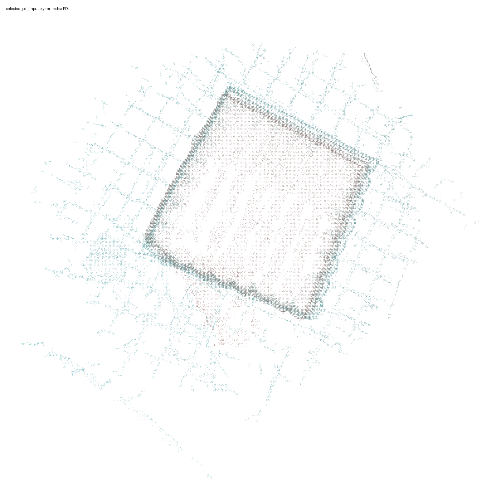
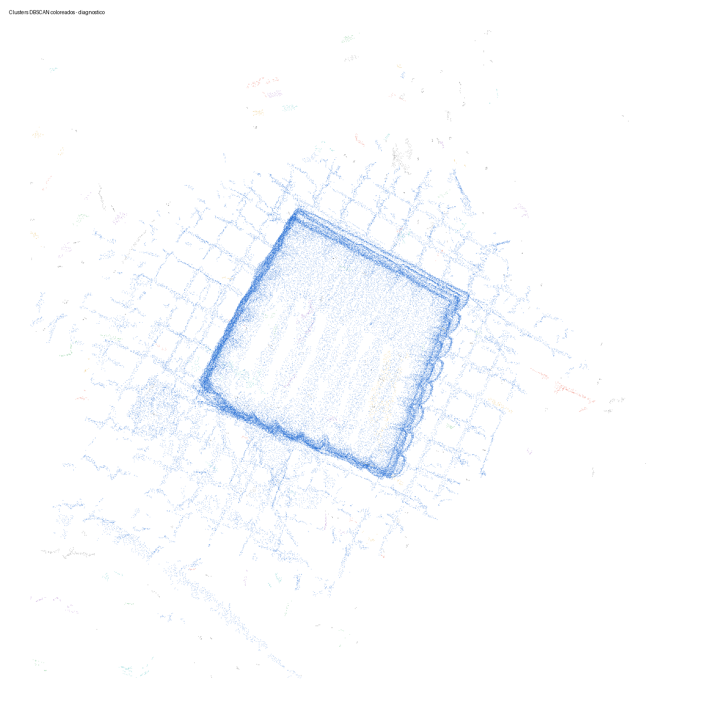
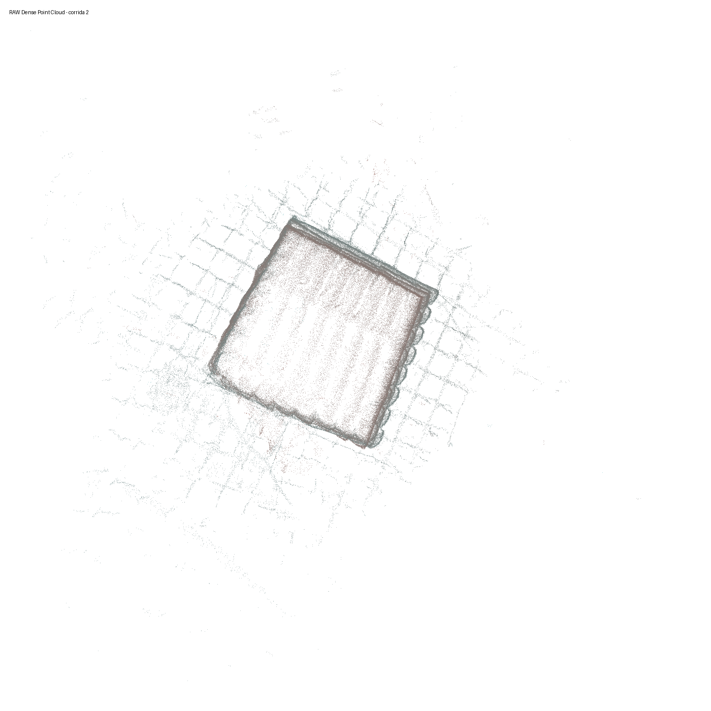
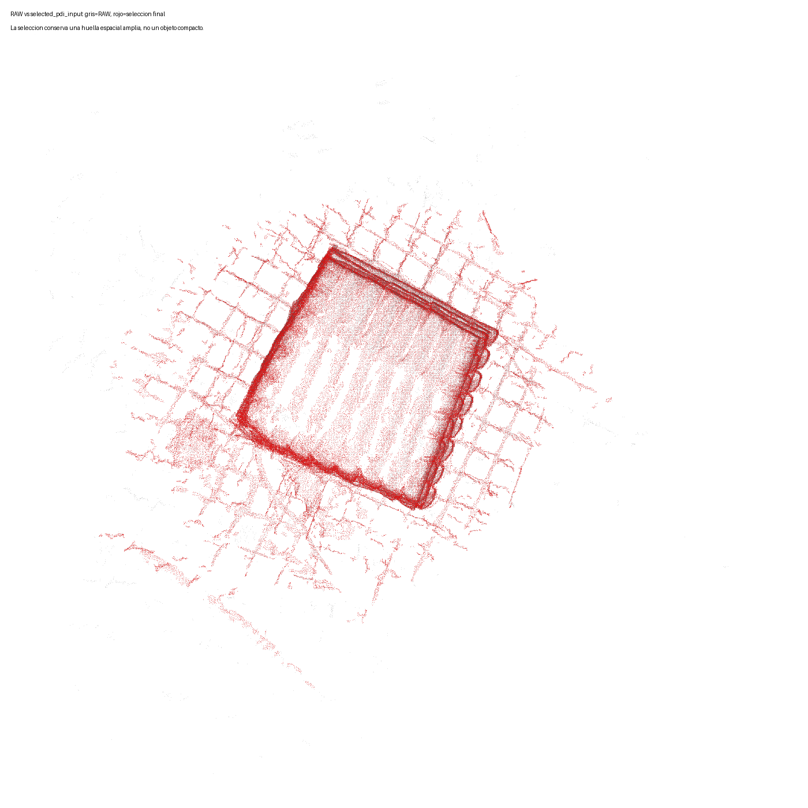

# Root Cause Analysis - nube de puntos dataset definitivo

## Decision

**La primera etapa donde el pipeline deja de representar unicamente el castillo es `RAW Dense Point Cloud`.**

La causa principal de la sobreestimacion es **A) Reconstruccion fotogrametrica**: la nube RAW ya contiene una escena amplia con terreno/fondo conectado al objeto. La causa que la deja pasar hacia PDI es **E) Seleccion de clusters**: DBSCAN produce un cluster dominante que mezcla castillo con entorno, y la regla `top_3_by_points` lo selecciona completo.

PDI no aparece como causa primaria: recibe una nube seleccionada con bbox enorme y calcula volumen sobre esa geometria.

## Evidencia cuantitativa

Las metricas por etapa provienen del `result.json` de la corrida 2. Las PLY intermedias de Outlier Removal, Voxelization y DBSCAN no fueron persistidas por el runner de validacion; por eso las imagenes intermedias se regeneran como vistas diagnosticas desde la RAW existente, sin reconstruir ni cambiar parametros.

|stage|point_count|bbox_extent_m|bbox_volume_m3|density_points_per_m3|distance_to_aruco_center_m|distance_to_castle_center_m|
|---|---|---|---|---|---|---|
|RAW Dense Point Cloud|1786481|[32.07781, 38.604008, 21.814888]|27014.074271|66.131491|9.015906|1.494014|
|Outlier Removal|1771982|[28.113837, 31.323624, 18.429358]|16229.3943|109.183496|9.051108|1.530692|
|Voxelization|146740|[28.099381, 31.294378, 18.38967]|16171.004855|9.074266|7.547293|0.112001|
|DBSCAN + Cluster Selection|141274|[23.552737, 22.492586, 8.354078]|4425.672767|31.921474|7.63108|0.0|
|PDI|141274|[23.552737, 22.492586, 8.354078]|4425.672767|31.921474|7.63108|0.0|
|selected_pdi_input.ply|141274|[23.552737, 22.492586, 8.354078]|4425.672767|31.921474|7.63108|0.0|

## Clusters exactos principales de la corrida

|rank|cluster_id|selected_by_pipeline|point_count|point_percent_total|bbox_extent_m|bbox_volume_m3|classification|
|---|---|---|---|---|---|---|---|
|1|0|True|140388|95.6713|[23.552737, 19.529496, 8.354078]|3842.651037|castillo + fuga dominante (suelo/fondo conectado)|
|2|27|True|527|0.3591|[5.082526, 4.594227, 0.896534]|20.934314|suelo / plano bajo|
|3|48|True|359|0.2447|[1.172711, 2.024215, 2.374816]|5.637387|vegetacion / fondo vertical|
|4|3|False|350|0.2385|[1.429202, 4.25546, 0.304129]|1.849687|suelo / plano bajo|
|5|55|False|345|0.2351|[3.389521, 2.069847, 0.727644]|5.104998|suelo / plano bajo|
|6|42|False|329|0.2242|[2.047485, 2.248338, 0.498469]|2.29467|suelo / plano bajo|
|7|47|False|278|0.1895|[1.146271, 1.466444, 1.540873]|2.590119|vegetacion / fondo vertical|
|8|76|False|275|0.1874|[2.037107, 1.086423, 0.594072]|1.314776|suelo / plano bajo|
|9|52|False|249|0.1697|[2.427805, 1.745791, 1.023424]|4.337719|vegetacion / fondo vertical|
|10|84|False|215|0.1465|[2.355548, 0.49548, 0.701366]|0.818583|suelo / plano bajo|

## Clasificacion solicitada

- Cluster que representa realmente el castillo: el castillo esta embebido dentro del cluster dominante `0`, pero ese cluster no representa solo el castillo; es `castillo + fuga dominante`.
- Clusters de suelo: clusters bajos con altura menor a ~1 m, especialmente `27`, `3`, `55`, `42`, `76`, `84` segun la tabla top10.
- Clusters de vegetacion/fondo: clusters con altura vertical mayor y bajo porcentaje, por ejemplo `48`, `47`, `52`.
- Ruido: puntos DBSCAN con etiqueta `-1` y clusters pequenos no seleccionados; el run exacto reporta `275` puntos de ruido.

## Bounding Box Analysis

El bounding box seleccionado mide `[23.552737, 22.492586, 8.354078]` m y tiene volumen bbox `4425.672767 m3`. No coincide visual ni dimensionalmente con un castillo aislado; incluye terreno, fondo o estructuras conectadas.

## Comparacion visual

## Root Cause

| Opcion | Veredicto | Evidencia |
|---|---|---|
| A) Reconstruccion fotogrametrica | Causa primaria | RAW ya mide 32.08 x 38.60 x 21.81 m y contiene escena amplia. |
| B) Outlier Removal | No primaria | Solo elimina 0.8116% de puntos; la caja sigue en 28.11 x 31.32 x 18.43 m. |
| C) Voxelizacion | No primaria | Reduce puntos, pero conserva caja 28.10 x 31.29 x 18.39 m. |
| D) DBSCAN | Separacion insuficiente | Detecta 104 clusters, pero el cluster principal sigue mezclando objeto y entorno. |
| E) Seleccion de clusters | Propagacion critica | Selecciona `0, 27, 48`; el cluster 0 solo ya tiene bbox 23.55 x 19.53 x 8.35 m. |
| F) PDI | No primaria | PDI integra la nube contaminada recibida; su hull es 1586.91 m3 y produce 946.0781 m3. |

## Conclusion

El pipeline comienza a incluir informacion que explica los volumenes de 800-900 m3 desde la reconstruccion RAW. La seleccion posterior no corrige esa contaminacion porque el entorno queda unido al castillo dentro del cluster dominante. Por lo tanto, la sobreestimacion no nace en PDI: PDI recibe una nube cuyo soporte espacial ya es de escena, no de objeto.
