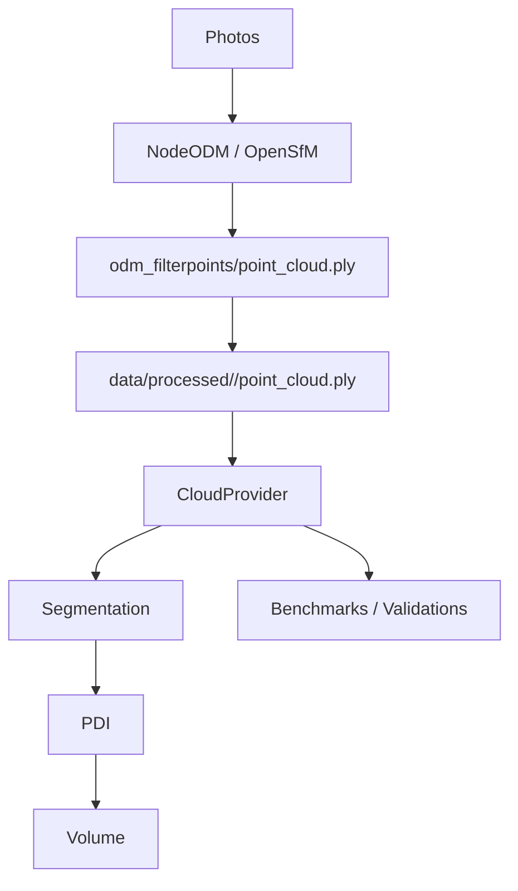
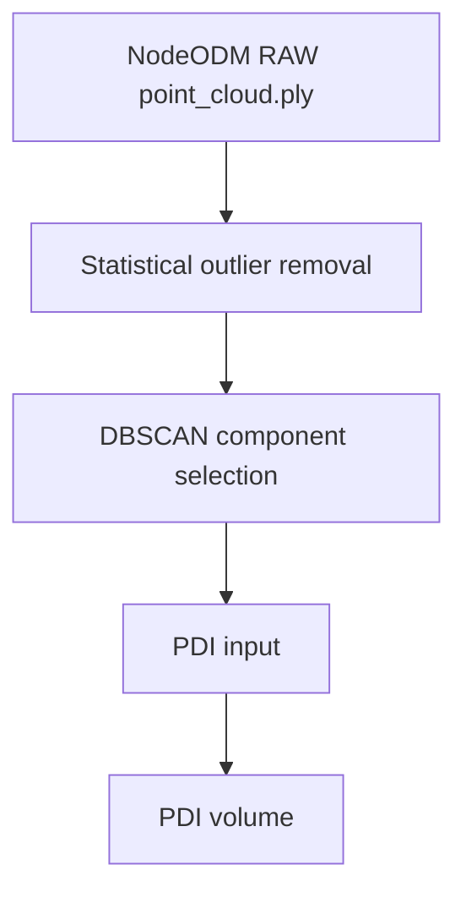

# ForestVol Architecture

## Canonical Point Cloud Source

ForestVol uses a single source of truth for dense point clouds:

`data/processed/<session_id>/point_cloud.ply`

This file is the NodeODM `odm_filterpoints/point_cloud.ply` artifact downloaded and persisted by the backend for the session.

## CloudProvider

All production volumetry and MVP benchmarks must resolve the input cloud through:

`backend.app.services.cloud_provider.load_pipeline_point_cloud(session_id, settings)`

The provider returns the canonical cloud path and a fingerprint:

- SHA256
- file size
- point count
- bounding box
- centroid

Benchmarks must validate this fingerprint before execution and abort on mismatch.

## Data Flow

## Prohibited Benchmark Sources

Benchmarks must not use:

- `surface_closure_diagnostics*/poisson_input_cloud.ply`
- historical exported clouds
- manual snapshots
- mesh-derived clouds
- NodeODM task folders directly

Historical diagnostics may still reference those files only to document past divergence.

## Pipeline Stage Instrumentation

The productive volumetry path can be instrumented without changing behavior:

The instrumentation artifacts live in:

`experiments/pipeline_stage_analysis/`

The stage analysis records, per dataset and per stage:

- point count
- bounding box and bbox volume
- centroid
- density
- nearest-neighbor distance
- connected components
- coverage and hole ratios
- Chamfer / Hausdorff / ICP deltas between stages

The latest diagnostic run identified DBSCAN/component selection as the largest information-loss stage:

- Set 1: RAW `401873` points -> PDI input `15799` points; `96.0687%` total point loss.
- Set 2: RAW `371766` points -> PDI input `3278` points; `99.1183%` total point loss.

This section is diagnostic only. It does not change NodeODM, OpenSfM, DBSCAN, PDI, calibration, segmentation parameters, or reconstruction parameters.

## DBSCAN Decision Analysis

The DBSCAN decision analysis is an isolated experiment located at:

`experiments/dbscan_decision_analysis/`

It instruments the productive segmentation step immediately after DBSCAN and records every cluster before the pipeline keeps only the selected components.

The experiment reports:

- cluster id
- point count and ratio
- bbox, centroid, density, convex hull volume, occupancy
- distance to global center and ground plane
- boundary contact
- current heuristic score
- selected/discarded status and discard reason
- PDI volume per cluster and per reasonable cluster combination

The latest run separates two effects that were previously grouped under "DBSCAN":

- segmentation voxelization before DBSCAN
- cluster selection after DBSCAN

Observed losses:

- Set 1: after-outlier `398562` -> DBSCAN input `31465` points (`92.11%` removed by segmentation voxelization), then selected clusters `15799` points (`49.79%` removed after DBSCAN input).
- Set 2: after-outlier `364166` -> DBSCAN input `4200` points (`98.85%` removed by segmentation voxelization), then selected clusters `3278` points (`21.95%` removed after DBSCAN input).

This is evidence only. No DBSCAN parameter, segmentation heuristic, or PDI behavior is changed by this experiment.
